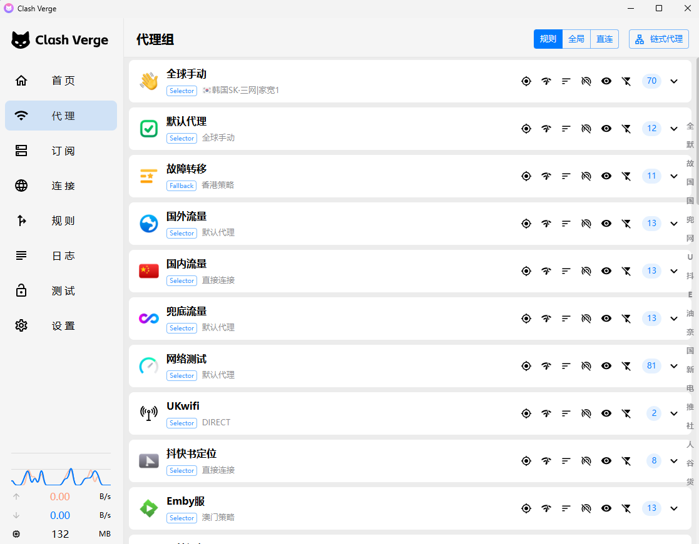
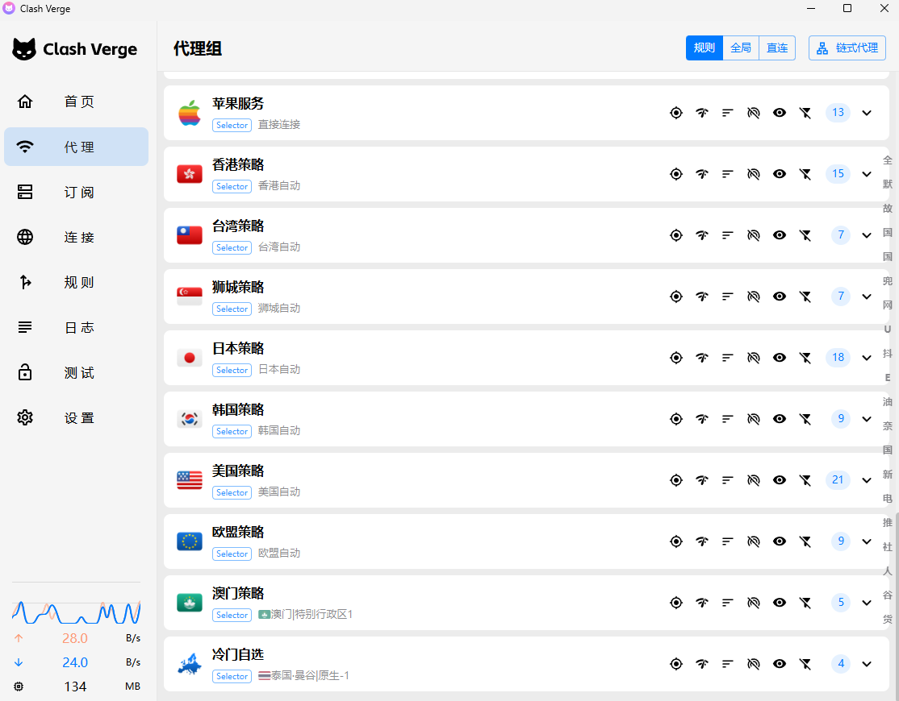
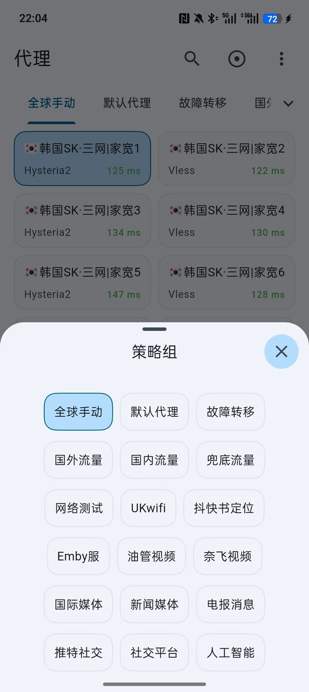
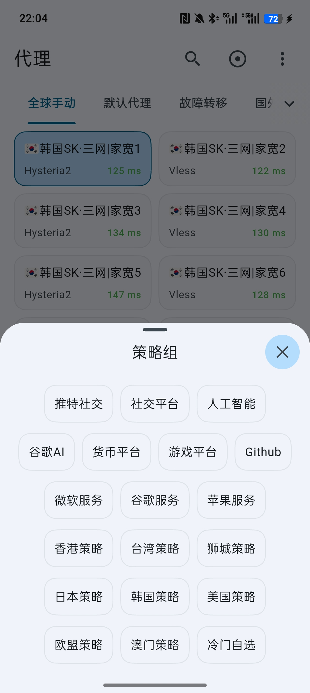

<div align="center">

# Clash Verge Rev & FlClash Custom Script

**一套 Mihomo 覆写脚本，让你换机场时不用重改配置。**

[](./Clash-Verge-Rev-mihomoScript.js)
[-支持-3ddc84)](./FlClash-mihomoScript.js)
[](https://github.com/MetaCubeX/mihomo)

</div>

> [!IMPORTANT]
> 本仓库只提供 Mihomo 配置覆写脚本，**不提供任何代理节点、机场订阅、网络接入或售卖服务**。

---

## 这是什么

大多数机场订阅自带的代理组和规则都各不相同、质量参差。这套脚本的做法是：

> **保留你当前机场的 `proxies` / `proxy-providers` 节点，把代理组、分流规则、Rule Providers、DNS、Sniffer、Hosts 全部重建为一套统一结构。**

所以你换任何机场，看到的都是同一套代理组和分流逻辑，节点还是那个机场自己的节点。

脚本里**不需要填任何机场 URL**，也不含任何节点信息。

---

## 快速开始

<details open>
<summary><b>Clash Verge Rev（桌面版）</b></summary>

1. 正常导入机场订阅
2. `订阅` → **全局扩展脚本**（注意是 Script，不是「全局扩展覆写配置 / Merge」）
3. 复制 [`Clash-Verge-Rev-mihomoScript.js`](./Clash-Verge-Rev-mihomoScript.js) 全文粘贴进去，保存
4. 刷新订阅

</details>

<details>
<summary><b>FlClash（Android）</b></summary>

1. 正常导入机场配置
2. `配置` → `覆写` → **新建 JavaScript 覆写**，复制 [`FlClash-mihomoScript.js`](./FlClash-mihomoScript.js) 全文粘贴保存
3. 回到机场配置，把这个覆写脚本关联到该配置上
4. **重要**：打开 `覆写编辑器 → 常规 → 查找进程` 开关，否则 `PROCESS-NAME` 包名规则（Gemini / NotebookLM App 分流）不生效
5. 如希望脚本的 DNS 完整生效，关闭 FlClash 自带的「覆写 DNS」

</details>

### Raw 地址

```text
https://raw.githubusercontent.com/hh1848/Clash-Verge-and-FlClash-Custom-Script/main/Clash-Verge-Rev-mihomoScript.js
https://raw.githubusercontent.com/hh1848/Clash-Verge-and-FlClash-Custom-Script/main/FlClash-mihomoScript.js
```

> Raw 地址用于查看或同步脚本源码，**不是订阅地址**，不要填进客户端的订阅框。

---

## 工作原理

```text
机场订阅
   ├── proxies ──────────┐
   └── proxy-providers ──┤  ← 节点全部保留，一个不删
                         ▼
                  自定义覆写脚本
                         │
        ┌────────────────┼────────────────┐
        ▼                ▼                ▼
  proxy-groups         rules         rule-providers
   (59 个)            (85 条)          (40 个)
        │
        ├── dns（Fake-IP + 国内外分流）
        ├── sniffer（HTTP / TLS / QUIC）
        ├── hosts（合并追加）
        └── tun / profile / 基础参数
                         │
                         ▼
                  最终 Mihomo 配置
```

**脚本不会把多个机场合并成一个。** 它的作用是让不同机场套用同一套骨架：

```text
机场 A ─┐
机场 B ─┼─→ 同一份覆写脚本 → 相同的代理组 / DNS / 规则结构
机场 C ─┘
```

切到哪个机场，用的就是那个机场自己的节点。

---

## 配置规模

| 项目 | 数量 |
| --- | --- |
| 代理组 | **59** |
| 分流规则 | **85** |
| Rule Providers | **40** |

两个版本脚本生成的代理组、Rule Providers **完全一致**，规则 FlClash 版多 8 条国内应用直连（7 条 `PROCESS-NAME` 精确包名 + 1 条 `PROCESS-NAME-REGEX` 厂商前缀，置顶），其余差异只在 TUN、进程查找、保活间隔等客户端适配项（见[两版差异](#两版脚本差异)）。

---

## 效果截图

### Clash Verge Rev（桌面端）

<div align="center">
  
  
</div>

### FlClash（Android）

<div align="center">
  
  
</div>

> 两组截图均为同一份列表的上下两屏，横向拼接即为完整的代理组清单。点击图片可查看原图。

---

## 代理组架构

### 核心组（8 个）

| 代理组 | 类型 | 用途 |
| --- | --- | --- |
| `全球手动` | `select` | 手动挑选具体节点，始终排第一 |
| `默认代理` | `select` | 默认代理入口 |
| `故障转移` | `fallback` | 地区之间自动故障切换 |
| `国外流量` | `select` | 通用国外流量 |
| `国内流量` | `select` | 国内流量 |
| `兜底流量` | `select` | 最终 `MATCH` 落点 |
| `直接连接` | `select` | 仅含 `DIRECT` |
| `网络测试` | `select` | Speedtest 等测速服务 |

### 服务分流组（18 个）

| 代理组 | 用途 | 默认首选 |
| --- | --- | --- |
| `人工智能` | ChatGPT / Claude / Gemini 等 | `美国策略` |
| `谷歌AI` | Google Gemini / NotebookLM / AI Studio | `美国策略` |
| `货币平台` | Crypto / 数字资产 | `狮城策略` |
| `游戏平台` | 游戏相关流量 | — |
| `Github` | GitHub | — |
| `微软服务` | Microsoft | — |
| `谷歌服务` | Google | — |
| `苹果服务` | Apple | — |
| `电报消息` | Telegram | — |
| `推特社交` | Twitter / X | — |
| `社交平台` | 其他国际社交平台 | — |
| `Emby服` | Emby | — |
| `油管视频` | YouTube | — |
| `奈飞视频` | Netflix | — |
| `国际媒体` | 国际流媒体 | — |
| `新闻媒体` | 国际新闻媒体 | — |
| `抖快书定位` | 抖音 / 快手 / 小红书定位 | — |
| `UKwifi` | WiFi Calling | — |

除 `UKwifi`（`DIRECT` / `欧盟策略`）外，其余服务组均可在默认代理、故障转移、各地区策略、全球手动、直接连接之间自由切换。

### 地区策略组（9 + 24 个）

脚本识别 **8 个地区**，每个地区生成 4 个组：

```text
香港策略  (select)
├── 香港自动        url-test
├── 香港均衡-散列    load-balance / consistent-hashing
└── 香港均衡-轮询    load-balance / round-robin
```

| 地区 | 策略组 | 自动测速 | 均衡-散列 | 均衡-轮询 |
| --- | --- | --- | --- | --- |
| 香港 | `香港策略` | `香港自动` | `香港均衡-散列` | `香港均衡-轮询` |
| 澳门 | `澳门策略` | `澳门自动` | `澳门均衡-散列` | `澳门均衡-轮询` |
| 台湾 | `台湾策略` | `台湾自动` | `台湾均衡-散列` | `台湾均衡-轮询` |
| 新加坡 | `狮城策略` | `狮城自动` | `狮城均衡-散列` | `狮城均衡-轮询` |
| 日本 | `日本策略` | `日本自动` | `日本均衡-散列` | `日本均衡-轮询` |
| 韩国 | `韩国策略` | `韩国自动` | `韩国均衡-散列` | `韩国均衡-轮询` |
| 美国 | `美国策略` | `美国自动` | `美国均衡-散列` | `美国均衡-轮询` |
| 欧盟 | `欧盟策略` | `欧盟自动` | `欧盟均衡-散列` | `欧盟均衡-轮询` |

识别不到的节点统一进入 **`冷门自选`**。

- **自动测速**：`url-test`，探测 `https://www.google.com/generate_204`，`interval: 200`，`lazy: true`
- **均衡-散列**：`consistent-hashing`，同一目标尽量固定在同一节点，适合登录态敏感的服务
- **均衡-轮询**：`round-robin`，在同地区多节点间轮换

---

## 节点识别

节点名称通过中文名、emoji 旗帜、英文缩写和机场三字码识别。

| 地区 | 识别关键词 |
| --- | --- |
| 香港 | 港 · 🇭🇰 · `HK` · Hong · HKG |
| 澳门 | 澳门 · 澳門 · 濠江 · 🇲🇴 · `MO` · Macau · Macao · MFM · Taipa · 氹仔 · 路氹 · Coloane · Cotai · MOG |
| 台湾 | 台 · 🇹🇼 · `TW` · Taiwan · TPE · TSA · KHH |
| 新加坡 | 坡 · 狮城 · 獅城 · 🇸🇬 · `SG` · Sing · SIN · XSP |
| 日本 | 日 · 🇯🇵 · 樱花 · 🌸 · 东京 · 大阪 · `JP` · Japan · NRT · HND · KIX · CTS · FUK |
| 韩国 | 韩 · 韓 · 首尔 · 首爾 · 🇰🇷 · `KR` · `KOR` · Korea |
| 美国 | 美 · 🇺🇸 · `US` · `USA` · JFK · SJC · LAX · ORD · ATL · DFW · SFO · MIA · SEA · IAD |
| 欧盟 | 法 · 德 · 意 · 西 · 荷 · 瑞 · 波 · 英 等成员国 + 🇦🇹 🇧🇪 🇨🇿 🇩🇰 🇫🇮 🇫🇷 🇩🇪 🇮🇪 🇮🇹 🇱🇹 🇱🇺 🇳🇱 🇵🇱 🇸🇪 🇬🇧 · CDG · FRA · AMS · MAD · BCN · FCO · MUC · BRU |

以下三个地区**没有独立的策略组**（节点归入 `欧盟策略`），仅用于在 `全球手动` 中排到更靠前的位置：

| 地区 | 识别关键词 | 排序位置 |
| --- | --- | --- |
| 英国 | 英 · 🇬🇧 · `UK` · `GB` · London · LHR · LGW | 第 8 位 |
| 德国 | 德 · 🇩🇪 · `DE` · Germany · Frankfurt · FRA · MUC | 第 9 位 |
| 法国 | 法 · 🇫🇷 · `FR` · France · Paris · CDG | 第 10 位 |

> 地区过滤器内置了 `排除1 / 排除2 / 5x / Plus / Australia / Africa / 尼日利亚` 等负向词，用于排除机场的「××节点 Plus」这类干扰命名。

---

## 全球手动

`全球手动` 是第一个代理组，用于直接挑节点。脚本会先**过滤机场公告类伪节点**，再按地区重排。

**过滤关键词**（命中即剔除）：

```text
群 · 邀请 · 返利 · 循环 · 官网 · 客服 · 网站 · 网址 · 获取 · 订阅 · 流量 · 到期
机场 · 下次 · 版本 · 官址 · 备用 · 过期 · 已用 · 联系 · 邮箱 · 工单 · 贩卖 · 通知
倒卖 · 防止 · 国内 · 地址 · 频道 · 无法 · 说明 · 使用 · 提示 · 访问 · 支持 · 教程
关注 · 更新 · 作者 · 加入 · 超时 · 重启 · 维护 · 暂停 · 失效 · 公告
USE · USED · TOTAL · EXPIRE · EMAIL · Panel · Channel · Author
```

**排序优先级**（同地区内保持机场原有顺序）：

| 顺序 | 地区 | 优先级值 |
| --- | --- | --- |
| 1 | 香港 | 10 |
| 2 | 澳门 | 15 |
| 3 | 台湾 | 20 |
| 4 | 新加坡 | 30 |
| 5 | 日本 | 40 |
| 6 | 韩国 | 50 |
| 7 | 美国 | 60 |
| 8 | 英国 | 70 |
| 9 | 德国 | 80 |
| 10 | 法国 | 90 |
| 末 | 其他 | 1000 |

> 排序只作用于 `config.proxies` 里的内联节点。`proxy-providers` 会通过 `use` 接入 `全球手动`，但其内部节点顺序由 Provider 自身和 Mihomo 决定，脚本不重排。

---

## 分流规则

共 **85 条**，自上而下匹配：

| 顺序 | 规则 | 目标 | 条数 |
| --- | --- | --- | --- |
| 1 | `Tracking` / `AWAvenueAds` / `Advertising` | `REJECT` | 3 |
| 2 | `AND,((DST-PORT,443),(NETWORK,UDP))` | `REJECT` | 1 |
| 3 | `ukwifi` | `UKwifi` | 1 |
| 4 | `LocationDKS` | `抖快书定位` | 1 |
| 5 | `Private` / `Direct` / `XPTV` / `Download` / `AppleCN` | `直接连接` | 5 |
| 6 | Gemini / NotebookLM（含 2 条 `PROCESS-NAME` 包名） | `谷歌AI` | 40 |
| 7 | `googleapis.com` / `googleusercontent.com` / `apis.google.com` 交还 `谷歌服务`（防 AI 列表宽后缀劫持 Gmail 翻译）+ AI 接口补齐 | `谷歌服务`/`谷歌AI` | 9 |
| 8 | `AI` | `人工智能` | 1 |
| 9 | `DOMAIN-KEYWORD,speedtest` + `Speedtest` | `网络测试` | 2 |
| 10 | `Twitter` / `Telegram` / `SocialMedia` / `NewsMedia` | 对应服务组 | 4 |
| 11 | `DOMAIN-SUFFIX,steamserver.net` | `直接连接` | 1 |
| 12 | `Games` / `Crypto` / `Emby` / `Netflix` / `YouTube` / `Streaming` / `Apple` / `Google` / `github` / `Microsoft` | 对应组 | 10 |
| 13 | `DOMAIN-SUFFIX,cn` — 所有 .cn 域名强制直连 | `国内流量` | 1 |
| 14 | `Proxy` / `China` | 对应组 | 2 |
| 15 | IP CIDR 规则（`no-resolve`） | 对应组 / `REJECT` | 12 |
| 末 | `MATCH` | `兜底流量` | 1 |

### 关于 QUIC / HTTP/3

第 4 条规则会**阻止 UDP 443**，因此 QUIC / HTTP/3 默认被禁用，连接通常回落到 TCP / HTTP/2。

绝大多数网站不受影响。如果某个应用强依赖 QUIC，自行删除这条规则即可：

```text
AND,((DST-PORT,443),(NETWORK,UDP)),REJECT
```

---

## Rule Providers

40 个，均为 `http` 类型。其中 37 个为 `.mrs` 格式（Mihomo 二进制规则集，体积小、加载快），其余 3 个为 `.list` / `.yaml`。

| 来源 | 数量 | 更新间隔 |
| --- | --- | --- |
| [666OS/rules](https://github.com/666OS/rules) — domain | 25 | 86400 |
| [666OS/rules](https://github.com/666OS/rules) — ipcidr | 12 | 86400 |
| [HenryChiao/wificalling](https://github.com/HenryChiao/wificalling) | 1 | 86400 |
| [AWAvenue Ads Rule](https://github.com/TG-Twilight/AWAvenue-Ads-Rule) | 1 | 86400 |
| [Kelee GitHub Rule](https://rule.kelee.one/Clash/GitHub.yaml) | 1 | 3600 |

**域名规则（25）**：Tracking · Advertising · Direct · LocationDKS · Private · Download · Speedtest · AI · Telegram · Twitter · SocialMedia · NewsMedia · Games · Crypto · Netflix · YouTube · XPTV · Emby · Streaming · AppleCN · Apple · Google · Microsoft · Proxy · China

**IP 规则（12）**：Advertising · Private · AI · Telegram · SocialMedia · XPTV · Emby · Netflix · Streaming · Google · Proxy · China

> 脚本本身不含规则数据，首次加载需联网从上述地址拉取。若规则源不可达，对应 Rule Provider 会加载失败并回退为空规则。

---

## DNS

启用 Fake-IP，国内外分流解析。

```yaml
enable: true
ipv6: true
enhanced-mode: fake-ip
fake-ip-range: 198.18.0.1/16
use-hosts: true
respect-rules: true
```

| 用途 | 服务器 |
| --- | --- |
| Bootstrap（`default-nameserver`） | `tls://223.5.5.5` · `tls://223.6.6.6` |
| 国外（`nameserver`） | Cloudflare DoH · Google DoH |
| 国内直连（`direct-nameserver`） | 阿里 DoH · `doh.pub` |
| 代理节点解析（`proxy-server-nameserver`） | 阿里 DoH · `doh.pub` |

**nameserver-policy**：

| 匹配 | 使用 DNS |
| --- | --- |
| `Advertising` + `AWAvenueAds` | `rcode://success`（直接丢弃） |
| `Direct` + `Private` + `China` | 国内 DoH |
| `Speedtest` `Twitter` `Telegram` `SocialMedia` `NewsMedia` `Games` `Crypto` `Emby` `Netflix` `YouTube` `Streaming` `Apple` `Google` `Microsoft` `Proxy` | Google / Cloudflare DoH |

**Fake-IP Filter**（这些绕过 Fake-IP，减少局域网、时间同步、推送受影响）：

```text
+.lan · +.local · time.*.com · ntp.*.com · +.market.xiaomi.com
+.pub.3gppnetwork.org · +.push.apple.com · +.bing.com
rule-set:Direct · rule-set:Private · rule-set:China
```

---

## 其他配置

### Sniffer（流量嗅探）

| 协议 | 端口 | 备注 |
| --- | --- | --- |
| HTTP | `80`, `8080-8880` | `override-destination: true` |
| TLS | `443`, `8443` | — |
| QUIC | `443`, `8443` | — |

跳过域名：`Mijia Cloud`、`+.push.apple.com`

### Hosts

在原 Hosts 基础上 `Object.assign()` 合并追加（不会清空机场原有 Hosts）：

```text
miwifi.com                                  → 192.168.31.2
epdg.epc.mnc010.mcc234.pub.3gppnetwork.org  → 87.194.8.8 / 87.194.88.8 / 87.194.89.8 / 87.194.9.8
services.googleapis.cn                      → services.googleapis.com
cn.bing.com                                 → www4.bing.com
```

### Mihomo 基础参数

```yaml
mode: rule
ipv6: true
unified-delay: true
tcp-concurrent: true
find-process-mode: strict
keep-alive-idle: 600

profile:
  store-selected: true   # 记住代理组选择
  store-fake-ip: true    # 记住 Fake-IP 状态
```

### TUN（仅 Clash Verge Rev）

脚本**不强制开启 TUN**，只在客户端已有 `tun` 配置上合并补充：

```yaml
stack: mixed
dns-hijack: [any:53, tcp://any:53]
auto-route: true
auto-redirect: true
auto-detect-interface: true
```

是否启用 TUN 仍由客户端自己的开关决定。

---

## 两版脚本差异

| 项目 | Clash Verge Rev | FlClash (Android) | 原因 |
| --- | --- | --- | --- |
| TUN 覆盖 | 合并补充 | **不修改** | Android 由 FlClash 的 VpnService 自行接管 |
| `quic-go-disable-gso` | 启用 | **移除** | 仅 Linux 内核有效，Android 无用 |
| `keep-alive-interval` | `15` | `30` | 省电，减少移动网络频繁唤醒 |
| `find-process-mode` | `strict` | `strict` | Android 上匹配应用包名，用于 App 分流 |
| 国内应用直连 | **无** | 新增 8 条（7 条 `PROCESS-NAME` 精确包名 + 1 条 `PROCESS-NAME-REGEX` 厂商前缀，置顶） | 所有国内 App 整应用强制直连：73 个厂商包名前缀（腾讯/阿里/字节/百度/网易/美团/京东/拼多多/B站/微博/小红书/爱奇艺/优酷/360/OPPO/vivo/游戏厂商/运营商/银行等，含全部 `cn.*` 包名空间）+ 9 个特殊包名（支付宝/滴滴/12306/携程等），覆盖域名列表收不齐的小程序业务域名 / 游戏服务器 IP；**需在 FlClash 打开「查找进程」开关**，正则需 mihomo v1.18.8+ |
| 代理组 / 规则 / Rule Providers | 59 / 85 / 40 | 59 / 93 / 40 | FlClash 多 8 条国内应用直连 |

---

## 兼容性

必须使用 **Mihomo 内核**。旧版 Clash Premium 或不支持扩展字段的客户端不适用。

脚本依赖的 Mihomo 特性：

```text
Rule Providers · MRS · include-all · filter · empty-fallback
load-balance · consistent-hashing · round-robin
Fake-IP · respect-rules · Sniffer · TUN
```

### 空配置保护

如果配置里既没有 `proxies` 也没有 `proxy-providers`，脚本**直接原样返回**，不做任何修改——避免订阅拉取失败时把配置清空。

### MihomoProPlus 名称保护

入口函数为 `main(config, profileName)`。当 Profile 名称包含 `MihomoProPlus` 时，脚本跳过处理，避免对模板本身二次覆写。

---

## 常见问题

<details>
<summary><b>能同时用多个机场吗？</b></summary>

可以，但脚本**不会把多个机场的节点合并到一个配置里**。每个机场各自套用同一套代理组和规则结构，切换配置时用的是当前机场的节点。

</details>

<details>
<summary><b>换机场要改脚本吗？</b></summary>

**Clash Verge Rev**：不用。全局扩展脚本会在每次刷新订阅时自动重新执行。

**FlClash**：不用改脚本，但要确认新机场的配置已关联这个覆写脚本。

</details>

<details>
<summary><b>为什么有些节点没按地区排序？</b></summary>

地区排序只作用于 `config.proxies` 的内联节点。机场若大量使用 `proxy-providers`，Provider 内部顺序由 Provider 和 Mihomo 决定。

</details>

<details>
<summary><b>为什么打不开某些 HTTP/3 网站？</b></summary>

脚本默认阻止 UDP 443 以禁用 QUIC。多数网站会自动回落 TCP，少数强依赖 QUIC 的服务受影响——删除那条规则即可。

</details>

<details>
<summary><b>FlClash 的 DNS 和脚本里写的不一样？</b></summary>

检查 FlClash 是否开启了自带的「覆写 DNS」。客户端若二次覆盖，脚本生成的 `dns` 不会完整保留。想用脚本的 DNS 就关掉它。

</details>

<details>
<summary><b>FlClash 上 Gemini App 没走谷歌AI？</b></summary>

`PROCESS-NAME` 包名规则要求 `find-process-mode` 生效。FlClash 应用层会用「覆写编辑器 → 常规 → 查找进程」开关的值覆盖脚本设置（默认关闭）。**必须在界面里手动打开这个开关**，仅靠脚本无效。

</details>

<details>
<summary><b>装了脚本还要开 TUN 吗？</b></summary>

脚本不替你决定。TUN 是否启用由客户端控制，脚本只补充参数（桌面版）。

</details>

---

## 更新

脚本更新后，重新复制对应文件内容覆盖客户端里的旧脚本，然后刷新一次订阅让配置重新生成。

```text
Clash Verge Rev → Clash-Verge-Rev-mihomoScript.js
FlClash         → FlClash-mihomoScript.js
```

---

## 致谢

部分设计、规则与资源参考自以下开源项目：

- [Mihomo](https://github.com/MetaCubeX/mihomo) — 内核
- [666OS/rules](https://github.com/666OS/rules) — 主要规则集
- [Koolson/Qure](https://github.com/Koolson/Qure) — 设计参考
- [AWAvenue Ads Rule](https://github.com/TG-Twilight/AWAvenue-Ads-Rule) — 广告规则
- [HenryChiao/wificalling](https://github.com/HenryChiao/wificalling) — WiFi Calling 规则

---

## Disclaimer

本项目仅用于 Mihomo 配置研究、学习与个人网络配置管理。

使用者应自行确保：

- 遵守所在国家或地区的法律法规
- 遵守网络服务提供商及相关平台的服务条款
- 自行判断第三方 Rule Provider 的可用性与安全性
- 自行承担配置修改造成的网络异常

**本项目不提供任何代理节点、机场订阅或相关网络服务。**
